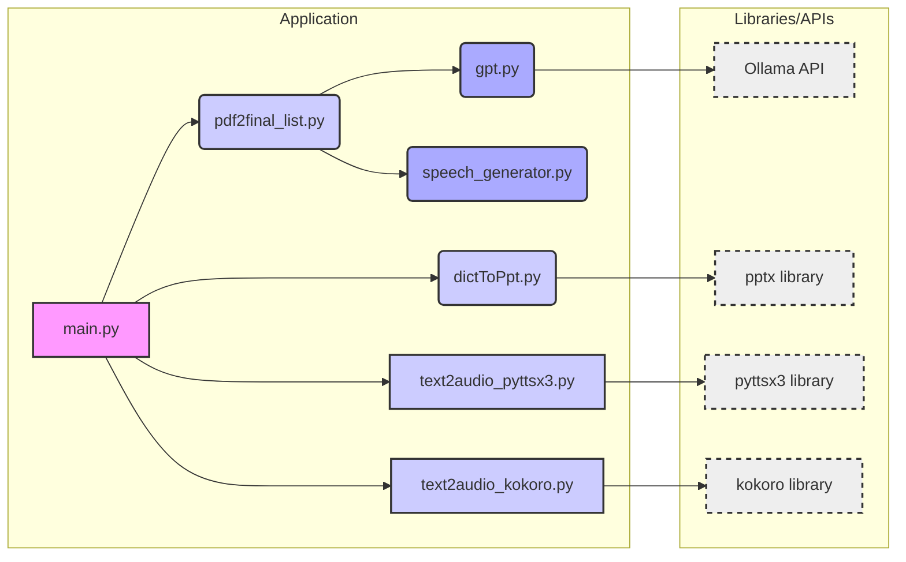

# SlideSpeak - Text to PPT &amp; Speech Generator

[](https://opensource.org/licenses/Apache-2.0)
[](https://www.python.org)
[](https://ollama.com/)
[](https://pytorch.org/)

**Qualcomm Technologies x Northeastern University Hackathon**

2025 March 15th - 16th

Team: NewTeamOne

Team members: Yuchen Jiang, Yuchen Li, Quancheng Li, Shi Zhang, Jiangtian Han

## Table of Contents

- [Intro](#intro)
- [Architecture](#architecture)
- [Prerequisites](#prerequisites)
- [Installation](#installation)
- [Running the Application](#running-the-application)
  - [Using the Graphical User Interface (GUI)](#using-the-graphical-user-interface-gui)
  - [Using the Command Line Interface (CLI)](#using-the-command-line-interface-cli)
- [Notes](#notes)
- [License](#license)

## Intro

SlideSpeak is a Python-based AI tool designed for:

- **Converting text queries into PowerPoint presentations and speech transcripts.**
- **Converting speech transcripts into audio files per slide for presentation rehearsal.**

It utilizes local Large Language Models (LLMs) served by Ollama to generate presentation outlines and slide content. Additionally, it integrates a local Text to Speech (TTS) model to convert speech transcripts into audio files.

**Text2PPT Live Demo Using NPU**


**Text2Audio Live Demo Using CPU**


## Architecture

The following diagram illustrates the main components of SlideSpeak and their relationships:



- **`main.py`**: Orchestrates the entire process, calling other modules for transcript and outline generation, PowerPoint creation, and TTS engine selection.
- **`pdf2final_list.py`**: Handles transcript and outline generation, utilizing `gpt.py` for LLM interactions and `speech_generator.py` for speech-related functionalities.
- **`dictToPpt.py`**: Responsible for creating PowerPoint presentations using the `pptx` library.
- **`text2audio_pyttsx3.py` &amp; `text2audio_kokoro.py`**: Provide TTS engine options using `pyttsx3` and `kokoro` libraries respectively.
- **`gpt.py`**: Interacts with the Ollama API to leverage LLMs.
- **`speech_generator.py`**: Contains tasks related to speech processing.

## Prerequisites

Before running SlideSpeak, ensure the following prerequisites are met:

1.  **Ollama**:

    - Download and install Ollama from [https://ollama.com/](https://ollama.com/). Follow the installation instructions for your OS.
    - Ensure Ollama is running in the background. Verify by running `ollama list` in your terminal to see installed models.

2.  **Python**:

    - Python 3.10 or higher is required. Download from [https://www.python.org/](https://www.python.org/).

3.  **Python Packages**:

    - Install necessary packages using pip. Virtual environment is recommended.
    - Navigate to the project directory and run:
      ```bash
      pip install python-pptx requests pywin32 kokoro soundfile numpy
      ```

4.  **Ollama Models**:

    - SlideSpeak uses `qwen2.5:7b` Ollama models. Pull these models from Ollama:
      ```bash
      ollama pull qwen2.5:7b
      ```

5.  **Kokoro TTS Models**:
    - Download Kokoro TTS model files and place them in the project root directory.
    - Download `kokoro-v1.0.onnx` from [https://github.com/thewh1teagle/kokoro-onnx/releases/download/model-files-v1.0/kokoro-v1.0.onnx](https://github.com/thewh1teagle/kokoro-onnx/releases/download/model-files-v1.0/kokoro-v1.0.onnx)
    - Download `voices-v1.0.bin` from [https://github.com/thewh1teagle/kokoro-onnx/releases/download/model-files-v1.0/voices-v1.0.bin](https://github.com/thewh1teagle/kokoro-onnx/releases/download/model-files-v1.0/voices-v1.0.bin)

## Installation

1.  **Clone the repository**:
    ```bash
    git clone [repository_url]
    cd SlideSpeak
    ```

## Running the Application

SlideSpeak can be run in two modes:

### Using the Graphical User Interface (GUI)

1.  Run the `gui.py` script:
    ```bash
    python gui.py
    ```
2.  Enter comma-separated topics in the GUI and press Enter.
3.  Find the generated PPTX presentation as `PPT.pptx` in the project directory.
4.  Presentation outline and speech transcript are saved in the `output` directory.
5.  Choose TTS engine in the GUI:
    - **text2audio_kokoro (Best Result)**: Uses Kokoro TTS for high-quality audio.
    - **text2audio_pyttsx3 (Fastest Result)**: Uses `pyttsx3` for faster audio generation.

### Using the Command Line Interface (CLI)

1.  Run `main.py` to generate PPTX with predefined topics:
    ```bash
    python main.py
    ```
2.  The generated PPTX file (`PPT.pptx`) is saved in the project directory.

## Notes

- **Model Selection**: Modify Ollama models (`qwen2.5:7b`) in `gpt.py` if needed.

- **NPU Option**: Users can also run this application on NPU via AnythingLLM. To do this, please following these steps:
    1. Under AnythingLLM Settings, find LLM, select `Qualcomm QNN` as LLM Provider.
    2. Download LLM that supports NPU.
    
    3. Then move onto Developer API, replace the api key in `gpt.py`.
    
    4. Find your workspace, or create one, replace it also in `gpt.py`, please note it should be all lower-cases.
    5. Lastly, select NPU Option in `Device Type` under `Generation Options` when the User Interface is initialized.
    

- **Error Handling**: Basic error handling is implemented; further improvements are possible.

- **Image Generation**: Current version uses Ollama for image prompts. But the image functionality is not fully implemented and needs further development for full PPTX image insertion.

## License

SlideSpeak is licensed under the [Apache License 2.0](LICENSE). See the `LICENSE` file for more details.
